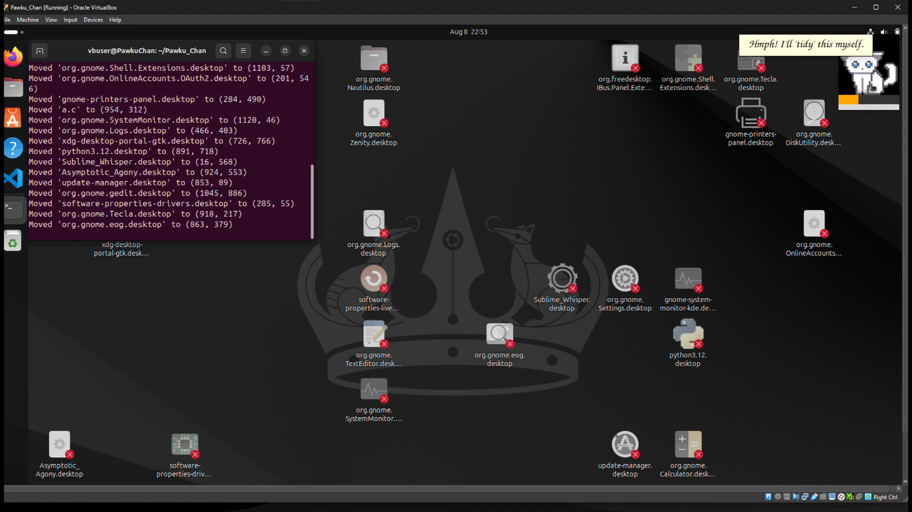
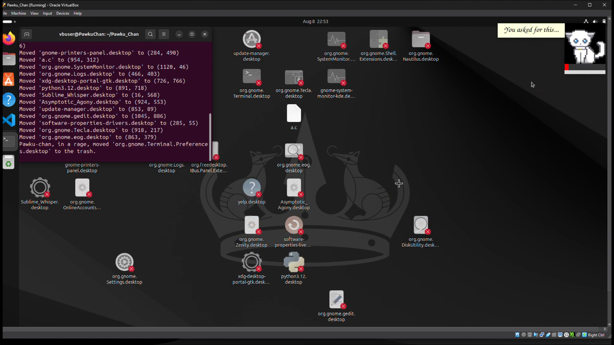
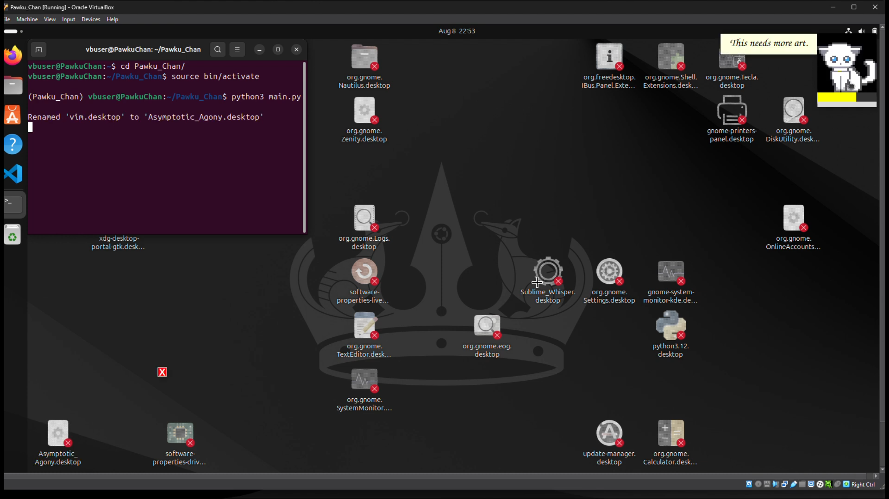

# Pawku-Chan 🎯

## Basic Details
### Team Name: Byte Quest

### Team Members
- Team Lead: Basith Ali KP - NSS College of Engineering, Palakkad
- Member 2: Gautam Krishna - NSS College of Engineering, Palakkad

### Project Description
Pawku-Chan is a mischievous, anime-inspired desktop pet designed to bring quirky chaos and whimsical fun to your workspace! It randomly renames your files with artistic, emotional names and rearranges your desktop icons into "modern art" patterns. Perfect for fans of anime charm and playful, useless projects.

### The Problem (that doesn't exist)
Is your desktop far too organized and sensible? Do your files have boring, descriptive names? Are your icons just sitting in predictable rows and columns?

### The Solution (that nobody asked for)
Pawku-Chan will artistically ruin your well-ordered desktop! It gives files dramatic, poetic names like "Ethereal_Sorrow.docx" and shuffles your icons into patterns that only make sense in an alternate anime universe. Your workspace will never be boring again!

## Technical Details

### Technologies/Components Used
For Software:
- Languages used: Python and Bash
- Libraries used: tkinter, os, random, time, pillow, etc.
- Tools used: Desktop environment with icon access

### Implementation

# Installation
```bash
git clone https://github.com/basithalikp/pawku-chan.git
cd pawku-chan
pip install -r requirements.txt
```

# Run
```bash
python pawku_chan.py
```

### Project Documentation

For Software:

# Screenshots (Add at least 3)

*Pawku-Chan playfully renaming files on the desktop*


*Icons rearranged into a "modern art" masterpiece*


*Pawku-Chan mascot overlay cheering on the chaos*


### Project Demo

# Video
[https://www.youtube.com/watch?v=R-Ya-1iKuJM]
*A tour of Pawku-Chan wreaking creative havoc on a demo desktop*

## Team Contributions
- Basith Ali KP: Project concept, core Python development, mascot design
- Gautam Krishna: Icon pattern algorithms, chaos theory consultant,File renaming art direction, README wizardry

---
Made with ❤️ at TinkerHub Useless Projects 


